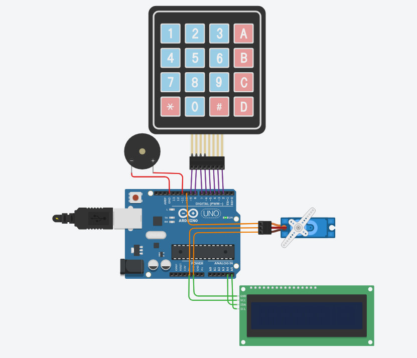

# 🔐 Smart Door Lock System using Arduino, Keypad, LCD & Servo Motor

  
 
    

## 📌 Project Overview

This project showcases a **smart door lock system** built using an **Arduino UNO**, a **4x4 matrix keypad**, an **I2C LCD display**, a **servo motor**, and a **buzzer**.
Users can unlock the door by entering a predefined multi-password. Wrong entries trigger an alert through the buzzer, making it secure and interactive.

  

✅ **Features:**

* Multiple predefined passwords
* Password masking on LCD
* Servo-controlled locking/unlocking
* Buzzer feedback for correct/incorrect entries
* Clear LCD prompts for user guidance

---

## 🛠️ Components Required

| Component         | Specification/Notes     |
| ----------------- | ----------------------- |
| Arduino UNO       | Microcontroller board   |
| LCD Display       | 16x2, I2C module (0x27) |
| 4x4 Matrix Keypad | Standard numeric keypad |
| Servo Motor       | SG90 or similar         |
| Buzzer            | Piezo or magnetic       |
| Jumper Wires      | For connections         |
| Power Supply      | 5V regulated            |

---

## 🏗️ Circuit Connections

| Component             | Arduino Pin        |
| --------------------- | ------------------ |
| **LCD Display (I2C)** | SDA → A4, SCL → A5 |
| **Buzzer**            | Digital Pin 11     |
| **Servo Motor**       | Digital Pin 10     |
| **Keypad Rows**       | 9, 8, 7, 6         |
| **Keypad Columns**    | 5, 4, 3, 2         |

---

## 🔌 Wiring Diagram

Check the **`circuit_diagram/`** folder for detailed connection images.

---

## 📜 Arduino Code

The `smart_lock.ino` file is included in this repository.

### ✅ Key Functions:

* **lockDoor()** – Sets servo to locked position and displays “LOCKED”
* **checkPassword()** – Validates user input against predefined passwords
* **reset\_Password()** – Resets the input and shows “RESETTING…” message
* **buzz(times)** – Provides buzzer feedback for user actions

Upload the `.ino` file via **Arduino IDE** and test the system using the keypad.

---

🔌 How to Use

Connect components according to the wiring diagram.

Upload smart_lock.ino to Arduino using Arduino IDE.

Enter a password using the keypad:

✅ Correct → Servo unlocks, LCD shows ACCESS GRANTED, buzzer 1 beep.

❌ Incorrect → LCD shows ACCESS DENIED, buzzer 3 beeps.

Press 'C' to reset input; LCD briefly shows “RESETTING…”.

  

---

## 💡 Practical Applications

* Home security systems
* Office access control
* Electronic locker systems
* Prototype for IoT-enabled smart locks

---

## 📜 License

This project is open-source under the **MIT License**.
Feel free to modify, enhance, or integrate it into your own projects.

